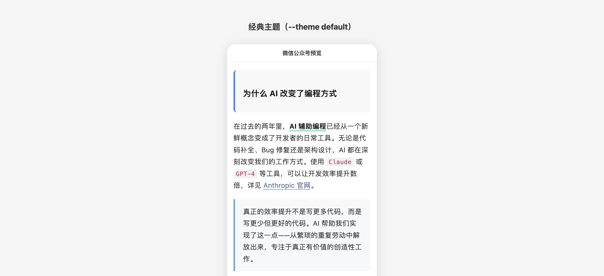
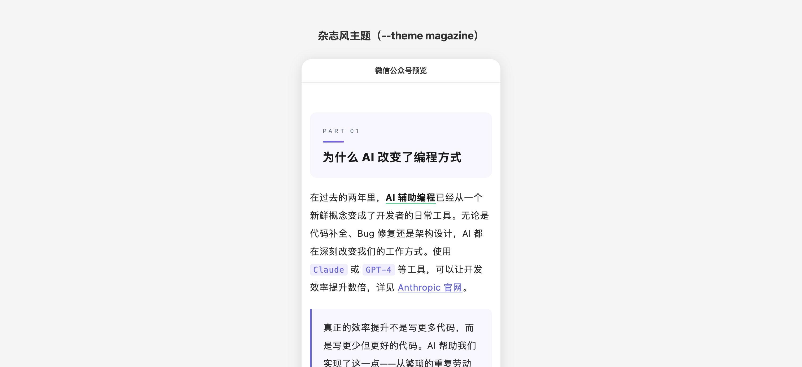
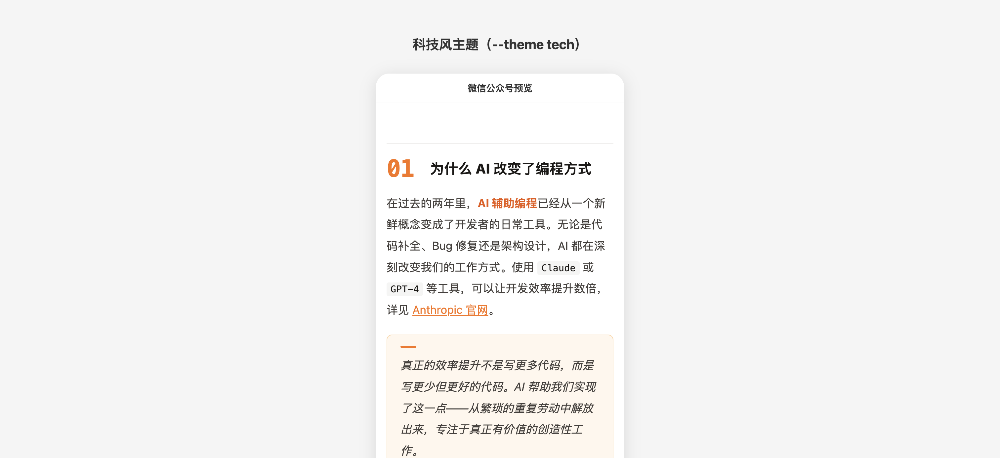
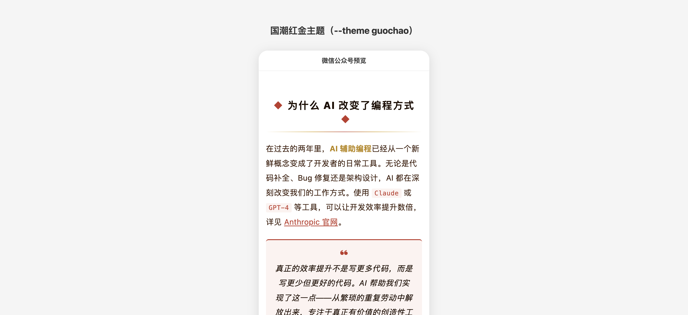
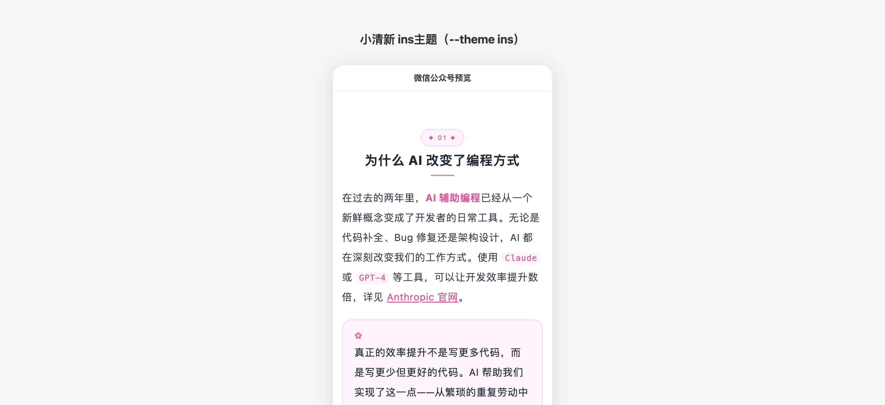
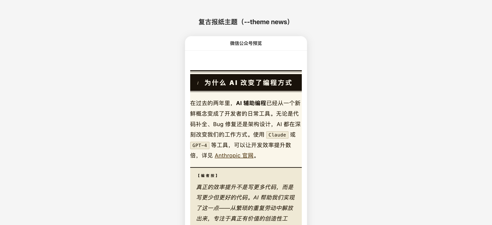

<p align="center">
  <h1 align="center">WeChat Publisher</h1>
  <p align="center">
    Markdown 一键转微信公众号文章，直达草稿箱。
  </p>
  <p align="center">
    <a href="./README.md">English</a>
  </p>
</p>

<p align="center">
  
  
  
  
</p>

---

## 简介

**WeChat Publisher** 将 Markdown 转换为微信公众号兼容的 HTML（纯内联样式），并通过微信官方 API 直接推送到草稿箱。支持魔搭 Qwen-Image-2512（国内免费直连）和 Gemini Pro 双通道生图，无需依赖外部工具。

```
Markdown ──▶ Sections ──▶ 微信 HTML ──▶ 公众号草稿箱
                                 ▲
                         Gemini Pro 封面
```

## 特性

- **一键发布** — Markdown 输入，草稿箱输出
- **6 种排版主题** — 经典、杂志、科技、国潮、ins、复古报纸，`--theme` 一键切换
- **macOS 风格代码块** — 红黄绿三圆点 + 横向滚动
- **双通道生图** — 魔搭 Qwen-Image-2512（国内免费）+ Gemini Pro（海外），自动回退
- **自动图片上传** — 本地图片自动上传到微信 CDN
- **纯内联样式** — 所有 CSS 内联，兼容微信渲染引擎

## 快速开始

### 环境要求

- Node.js 18+
- 微信公众号 AppID 和 AppSecret（[申请地址](https://mp.weixin.qq.com/)）
- 魔搭 ModelScope API Token 或 Gemini API Key（可选，用于生成封面图）

### 安装

```bash
git clone https://github.com/xiaonan0527/wechat-publisher.git
cd wechat-publisher
```

### 配置

```bash
cp .env.example .env
```

#### 获取微信公众号 AppID 和 AppSecret

1. 登录 [微信开发者平台](https://developers.weixin.qq.com/)
2. 进入你的公众号 → **开发** → **基本配置**
3. 找到 **AppID**（应用ID），这就是你的 `WECHAT_APPID`
4. 点击 **AppSecret**（应用密钥）旁边的 **生成** 按钮，创建新的密钥
5. 立即复制 AppSecret（仅显示一次），这就是你的 `WECHAT_APPSECRET`


> **重要提示**：如果你在云服务器上运行此工具，必须在同一基本配置页面中将服务器的公网 IP 地址添加到 **IP 白名单**（IP白名单）中。否则，微信 API 调用将被拒绝。

#### 设置环境变量

编辑 `.env`，填入你的凭证：

```env
WECHAT_APPID=your_appid
WECHAT_APPSECRET=your_appsecret

# 封面图生成（二选一或同时配置）
MODELSCOPE_API_KEY=your_token             # 推荐，国内直连，免费
# GEMINI_API_KEY=your_gemini_key          # 备选，需要代理
# GEMINI_PRO_PROXY=http://127.0.0.1:7890  # 可选，Gemini 代理

# WECHAT_DEFAULT_AUTHOR=你的名字          # 可选，默认"龙虾"
```

> **获取魔搭 Token**：注册 [modelscope.cn](https://modelscope.cn)，然后在 [我的令牌](https://modelscope.cn/my/myaccesstoken) 页面获取。完全免费。

### 发布文章

```bash
node scripts/publish.mjs \
  --title "文章标题" \
  --content "$(cat article.md)" \
  --author "龙虾"
```

| 参数 | 必填 | 说明 |
|------|------|------|
| `--title` | 是 | 文章标题 |
| `--content` | 是 | 文章内容（Markdown 格式） |
| `--author` | 否 | 作者名（默认：`龙虾`） |
| `--no-cover` | 否 | 跳过封面图生成 |
| `--image-provider` | 否 | `modelscope`（魔搭）或 `gemini`（默认自动选择） |
| `--theme` | 否 | 排版主题，见下方主题一览（默认 `default`） |

## 主题风格

共 6 种主题，通过 `--theme` 参数切换。

### `default` — 经典

蓝色系，中规中矩，适合大多数内容。蓝色引用块、荧光笔加粗高亮。



### `magazine` — 杂志风

紫色渐变，`PART 01` 编号章节卡片，大留白，高级感。适合深度长文。



### `tech` — 科技风

暖橙色系。H2 左侧超大数字锚点（`01`/`02`），橙色圆圈有序列表，短横线无序列表。适合技术文章。



### `guochao` — 国潮红金

中国红 + 暗金色。`◆ 标题 ◆` 居中对称，红金渐变下划线，`❝ ❞` 书法引号引用块。适合文化、品牌类内容。



### `ins` — 小清新 ins 风

粉色系。圆角 chip 序号标签，粉橙渐变圆圈有序列表，✿ 装饰引用卡片，整体圆润温柔。适合生活方式、轻内容。



### `news` — 复古报纸

泛黄纸底（`#faf6e9`）。黑色实底白字 H2 标题栏 + 罗马数字，`【编者按】` 双线引用框，`»` 列表符号，三线分隔。适合叙事、历史类内容。



## 项目结构

```
wechat-publisher/
├── scripts/
│   ├── publish.mjs              # 主入口 — 编排完整发布流程
│   ├── markdown-to-sections.mjs # Markdown 解析器 → Section 数据结构
│   ├── wechat-renderer.mjs      # Section 数据 → 微信兼容内联 HTML
│   ├── modelscope-imagegen.mjs  # 魔搭 Qwen-Image-2512 生图（国内免费）
│   └── gemini-imagegen.mjs      # Gemini Pro 生图（海外）
├── .env.example                 # 环境变量模板
├── SKILL.md                     # OpenClaw skill 定义
└── README.md
```

## 工作原理

```
┌─────────────┐     ┌──────────────────────┐     ┌─────────────────┐
│   Markdown   │────▶│ markdown-to-sections │────▶│   Section 数组   │
└─────────────┘     └──────────────────────┘     └────────┬────────┘
                                                          │
                    ┌──────────────────────┐              ▼
                    │  wechat-renderer     │◀─────────────┘
                    │  (内联样式,           │
                    │   macOS 代码块)       │
                    └──────────┬───────────┘
                               │
┌─────────────┐               ▼
│   封面图     │     ┌──────────────────────┐     ┌─────────────────┐
│ 魔搭/Gemini │────▶│  上传微信 CDN +       │────▶│   公众号草稿     │
└─────────────┘     │  创建草稿             │     │   (Media ID)    │
                    └──────────────────────┘     └─────────────────┘
```

### 流水线详解

1. **解析** — `markdown-to-sections.mjs` 将 Markdown 转为类型化的 Section 数组（标题、段落、代码块、列表等）
2. **渲染** — `wechat-renderer.mjs` 将每个 Section 转为微信兼容的纯内联样式 HTML
3. **生成封面** — `modelscope-imagegen.mjs`（Qwen-Image-2512，推荐）或 `gemini-imagegen.mjs`（Gemini Pro）生成 16:9 封面图，支持自动回退
4. **上传发布** — `publish.mjs` 上传图片到微信 CDN 并通过微信公众号 API 创建草稿

### 代码块渲染

代码块使用 macOS 风格标题栏（三色圆点）+ 横向滚动：

- header 使用 `line-height:0; font-size:0` 消除 inline-block 间距（微信不可靠支持 `display:flex`）
- 每行用 `<p style="white-space:nowrap">` 包裹，禁止折行
- 空格转换为 `&nbsp;` 兼容微信
- `font-family` 中带空格的字体名使用**单引号**，避免截断 `style="..."` 属性

## 编程接口

```javascript
import { markdownToSections } from './scripts/markdown-to-sections.mjs';
import { wxRenderSections } from './scripts/wechat-renderer.mjs';

// 支持 6 种主题：default / magazine / tech / guochao / ins / news
const theme = 'tech';
const sections = markdownToSections(markdownString, { theme });
const html = wxRenderSections(sections, { theme });
```

## 安全性

- 所有密钥从环境变量读取
- `.env` 已加入 `.gitignore`
- 提供 `.env.example` 安全模板
- 代码中无任何硬编码密钥

## 参与贡献

1. Fork 本仓库
2. 创建特性分支（`git checkout -b feat/amazing-feature`）
3. 提交更改（`git commit -m 'feat: add amazing feature'`）
4. 推送分支（`git push origin feat/amazing-feature`）
5. 创建 Pull Request

## 许可证

[MIT](./LICENSE)

## 请我喝咖啡

如果这个项目对你有帮助，欢迎支持我：

[](https://ko-fi.com/xiaonan0527)

## 作者

**楠哥** ([@xiaonan0527](https://github.com/xiaonan0527))

